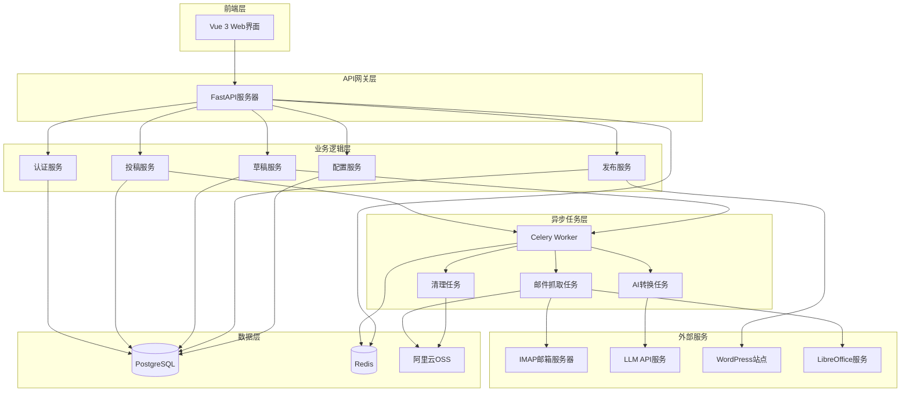

# 设计文档 - 荣耀AI审核发布系统

## 概述

荣耀AI审核发布系统是一个基于微服务架构的内容处理平台，采用前后端分离设计。系统由三个核心模块组成：邮件抓取引擎（IMAP Fetcher）、AI智能转换器（AI Transformer）和审核分发后台（Audit Dashboard）。

系统使用异步任务队列处理耗时操作，确保用户界面响应流畅。所有敏感配置信息采用加密存储，通过JWT令牌实现用户认证和授权。

技术栈：
- 前端：Vue 3 + Element Plus + Vite
- 后端：FastAPI (Python 3.10+)
- 任务队列：Celery + Redis
- 数据库：PostgreSQL 14+
- 对象存储：阿里云 OSS
- 文档处理：LibreOffice 7.x (headless mode)
- 容器化：Docker + Docker Compose

## 架构

### 系统架构图



### 模块职责

**前端模块 (Vue 3 + Element Plus)**
- 提供用户登录界面
- 提供投稿列表和状态展示
- 提供双栏对比审核界面
- 提供配置管理界面（管理员）
- 实时显示任务进度

**API服务模块 (FastAPI)**
- 处理HTTP请求和响应
- JWT令牌验证和用户授权
- 调用业务逻辑服务
- WebSocket支持（实时任务状态推送）

**异步任务模块 (Celery)**
- 邮件抓取任务：定时检查邮箱，提取投稿
- 文档转换任务：.doc转.docx，提取内容和图片
- AI转换任务：调用LLM进行语义转换
- 清理任务：定时清理过期数据和压缩图片

**数据存储模块**
- PostgreSQL：存储用户、投稿、草稿、配置等结构化数据
- Redis：存储任务状态、会话信息、缓存
- 阿里云OSS：存储图片和文档文件

## 组件和接口

### 核心组件

#### 1. 认证服务 (AuthService)

```python
class AuthService:
    """用户认证和授权服务"""
    
    def authenticate(username: str, password: str) -> Optional[User]:
        """验证用户凭证"""
        pass
    
    def generate_token(user: User) -> str:
        """生成JWT令牌"""
        pass
    
    def verify_token(token: str) -> Optional[User]:
        """验证JWT令牌"""
        pass
    
    def check_permission(user: User, resource: str, action: str) -> bool:
        """检查用户权限"""
        pass
```

#### 2. 投稿服务 (SubmissionService)

```python
class SubmissionService:
    """投稿管理服务"""
    
    def create_submission(email_data: EmailData) -> Submission:
        """创建投稿记录"""
        pass
    
    def get_submission(submission_id: int) -> Optional[Submission]:
        """获取投稿详情"""
        pass
    
    def list_submissions(filters: dict, page: int, size: int) -> List[Submission]:
        """获取投稿列表"""
        pass
    
    def trigger_ai_transform(submission_id: int) -> str:
        """触发AI转换任务"""
        pass
```

#### 3. 草稿服务 (DraftService)

```python
class DraftService:
    """草稿管理服务"""
    
    def create_draft(submission_id: int, transformed_content: str) -> Draft:
        """创建草稿"""
        pass
    
    def update_draft(draft_id: int, content: str) -> Draft:
        """更新草稿内容（创建新版本）"""
        pass
    
    def get_draft(draft_id: int) -> Optional[Draft]:
        """获取草稿详情"""
        pass
    
    def get_versions(draft_id: int) -> List[DraftVersion]:
        """获取草稿版本历史"""
        pass
    
    def restore_version(draft_id: int, version_id: int) -> Draft:
        """恢复到指定版本"""
        pass
```

#### 4. 发布服务 (PublishService)

```python
class PublishService:
    """WordPress发布服务"""
    
    def publish_to_wordpress(draft_id: int, site_id: int) -> PublishResult:
        """发布内容到WordPress站点"""
        pass
    
    def get_available_sites() -> List[WordPressSite]:
        """获取可用的WordPress站点列表"""
        pass
    
    def verify_site_connection(site_id: int) -> bool:
        """验证站点连接"""
        pass
```

#### 5. 配置服务 (ConfigService)

```python
class ConfigService:
    """系统配置管理服务"""
    
    def set_config(key: str, value: str, encrypted: bool = False) -> None:
        """设置配置项"""
        pass
    
    def get_config(key: str, decrypt: bool = False) -> Optional[str]:
        """获取配置项"""
        pass
    
    def verify_llm_config() -> bool:
        """验证LLM配置"""
        pass
    
    def verify_oss_config() -> bool:
        """验证OSS配置"""
        pass
    
    def verify_imap_config() -> bool:
        """验证IMAP配置"""
        pass
```

### 异步任务

#### 1. 邮件抓取任务 (IMAPFetcherTask)

```python
@celery_app.task
def fetch_emails_task():
    """定时抓取邮件任务"""
    # 1. 连接IMAP服务器
    # 2. 获取未读邮件
    # 3. 提取附件和内容
    # 4. 转换.doc为.docx
    # 5. 提取图片并上传OSS
    # 6. 创建Submission记录
    # 7. 触发AI转换任务
    pass

@celery_app.task
def convert_doc_to_docx(file_path: str) -> str:
    """使用LibreOffice转换文档格式"""
    pass

@celery_app.task
def extract_images_from_docx(docx_path: str) -> List[str]:
    """从docx提取图片并上传OSS"""
    pass
```

#### 2. AI转换任务 (AITransformTask)

```python
@celery_app.task
def transform_content_task(submission_id: int):
    """AI语义转换任务"""
    # 1. 获取原始内容
    # 2. 构建LLM提示词
    # 3. 调用LLM API进行转换
    # 4. 解析转换结果
    # 5. 创建Draft记录
    pass

def build_transform_prompt(content: str) -> str:
    """构建AI转换提示词"""
    # 提示词要求：
    # - 第一人称转第三人称
    # - 保护引用内容（引号内容）
    # - 规范化时间表述
    pass
```

#### 3. 清理任务 (CleanupTask)

```python
@celery_app.task
def cleanup_old_data_task():
    """定时清理过期数据"""
    # 1. 查找365天前的图片
    # 2. 压缩图片到60%质量
    # 3. 查找730天前的记录
    # 4. 删除Submission和Draft
    # 5. 记录清理日志
    pass

@celery_app.task
def compress_image(oss_key: str, quality: int = 60):
    """压缩OSS图片"""
    pass
```

### REST API接口

#### 认证接口

```
POST /api/auth/login
请求体: {"username": "string", "password": "string"}
响应: {"token": "string", "user": {...}}

POST /api/auth/logout
请求头: Authorization: Bearer <token>
响应: {"message": "success"}
```

#### 投稿接口

```
GET /api/submissions
查询参数: page, size, status
响应: {"items": [...], "total": int}

GET /api/submissions/{id}
响应: {"id": int, "content": "string", "status": "string", ...}

POST /api/submissions/{id}/transform
触发AI转换
响应: {"task_id": "string"}
```

#### 草稿接口

```
GET /api/drafts/{id}
响应: {"id": int, "original": "string", "transformed": "string", ...}

PUT /api/drafts/{id}
请求体: {"content": "string"}
响应: {"id": int, "version": int, ...}

GET /api/drafts/{id}/versions
响应: {"versions": [...]}

POST /api/drafts/{id}/restore/{version_id}
响应: {"id": int, "content": "string", ...}
```

#### 发布接口

```
GET /api/wordpress/sites
响应: {"sites": [...]}

POST /api/drafts/{id}/publish
请求体: {"site_id": int}
响应: {"success": bool, "wordpress_post_id": int}
```

#### 配置接口（管理员）

```
GET /api/config
响应: {"configs": {...}}

PUT /api/config
请求体: {"key": "string", "value": "string", "encrypted": bool}
响应: {"message": "success"}

POST /api/config/verify/llm
响应: {"valid": bool}

POST /api/config/verify/oss
响应: {"valid": bool}

POST /api/config/verify/imap
响应: {"valid": bool}
```

## 数据模型

### 数据库表结构

#### User（用户表）

```sql
CREATE TABLE users (
    id SERIAL PRIMARY KEY,
    username VARCHAR(50) UNIQUE NOT NULL,
    password_hash VARCHAR(255) NOT NULL,
    role VARCHAR(20) NOT NULL, -- 'admin' 或 'editor'
    created_at TIMESTAMP DEFAULT CURRENT_TIMESTAMP,
    updated_at TIMESTAMP DEFAULT CURRENT_TIMESTAMP
);
```

#### Submission（投稿表）

```sql
CREATE TABLE submissions (
    id SERIAL PRIMARY KEY,
    email_subject VARCHAR(255),
    email_from VARCHAR(255),
    email_date TIMESTAMP,
    original_content TEXT NOT NULL,
    doc_file_path VARCHAR(500),
    docx_file_path VARCHAR(500),
    status VARCHAR(20) NOT NULL, -- 'pending', 'processing', 'completed', 'failed'
    error_message TEXT,
    created_at TIMESTAMP DEFAULT CURRENT_TIMESTAMP,
    updated_at TIMESTAMP DEFAULT CURRENT_TIMESTAMP
);
```

#### SubmissionImage（投稿图片表）

```sql
CREATE TABLE submission_images (
    id SERIAL PRIMARY KEY,
    submission_id INTEGER REFERENCES submissions(id) ON DELETE CASCADE,
    oss_url VARCHAR(500) NOT NULL,
    oss_key VARCHAR(500) NOT NULL,
    original_filename VARCHAR(255),
    file_size INTEGER,
    compressed BOOLEAN DEFAULT FALSE,
    created_at TIMESTAMP DEFAULT CURRENT_TIMESTAMP
);
```

#### Draft（草稿表）

```sql
CREATE TABLE drafts (
    id SERIAL PRIMARY KEY,
    submission_id INTEGER REFERENCES submissions(id) ON DELETE CASCADE,
    current_content TEXT NOT NULL,
    current_version INTEGER DEFAULT 1,
    status VARCHAR(20) NOT NULL, -- 'draft', 'published'
    published_at TIMESTAMP,
    published_to_site_id INTEGER,
    wordpress_post_id INTEGER,
    created_at TIMESTAMP DEFAULT CURRENT_TIMESTAMP,
    updated_at TIMESTAMP DEFAULT CURRENT_TIMESTAMP
);
```

#### DraftVersion（草稿版本表）

```sql
CREATE TABLE draft_versions (
    id SERIAL PRIMARY KEY,
    draft_id INTEGER REFERENCES drafts(id) ON DELETE CASCADE,
    version_number INTEGER NOT NULL,
    content TEXT NOT NULL,
    created_by INTEGER REFERENCES users(id),
    created_at TIMESTAMP DEFAULT CURRENT_TIMESTAMP,
    UNIQUE(draft_id, version_number)
);
```

#### WordPressSite（WordPress站点表）

```sql
CREATE TABLE wordpress_sites (
    id SERIAL PRIMARY KEY,
    name VARCHAR(100) NOT NULL,
    url VARCHAR(255) NOT NULL,
    api_username VARCHAR(100),
    api_password_encrypted TEXT,
    active BOOLEAN DEFAULT TRUE,
    created_at TIMESTAMP DEFAULT CURRENT_TIMESTAMP,
    updated_at TIMESTAMP DEFAULT CURRENT_TIMESTAMP
);
```

#### SystemConfig（系统配置表）

```sql
CREATE TABLE system_configs (
    id SERIAL PRIMARY KEY,
    config_key VARCHAR(100) UNIQUE NOT NULL,
    config_value TEXT,
    encrypted BOOLEAN DEFAULT FALSE,
    description TEXT,
    updated_at TIMESTAMP DEFAULT CURRENT_TIMESTAMP
);
```

#### TaskLog（任务日志表）

```sql
CREATE TABLE task_logs (
    id SERIAL PRIMARY KEY,
    task_type VARCHAR(50) NOT NULL, -- 'fetch_email', 'ai_transform', 'cleanup'
    task_id VARCHAR(100),
    status VARCHAR(20) NOT NULL, -- 'started', 'success', 'failed'
    message TEXT,
    created_at TIMESTAMP DEFAULT CURRENT_TIMESTAMP
);
```

### Python数据模型

#### Pydantic模型（API请求/响应）

```python
from pydantic import BaseModel
from datetime import datetime
from typing import Optional, List

class UserBase(BaseModel):
    username: str
    role: str

class UserCreate(UserBase):
    password: str

class User(UserBase):
    id: int
    created_at: datetime
    
    class Config:
        from_attributes = True

class LoginRequest(BaseModel):
    username: str
    password: str

class TokenResponse(BaseModel):
    token: str
    user: User

class SubmissionBase(BaseModel):
    email_subject: Optional[str]
    email_from: Optional[str]
    original_content: str

class Submission(SubmissionBase):
    id: int
    status: str
    created_at: datetime
    images: List['SubmissionImage'] = []
    
    class Config:
        from_attributes = True

class SubmissionImage(BaseModel):
    id: int
    oss_url: str
    original_filename: Optional[str]
    
    class Config:
        from_attributes = True

class DraftBase(BaseModel):
    current_content: str

class Draft(DraftBase):
    id: int
    submission_id: int
    current_version: int
    status: str
    created_at: datetime
    
    class Config:
        from_attributes = True

class DraftVersion(BaseModel):
    id: int
    version_number: int
    content: str
    created_at: datetime
    
    class Config:
        from_attributes = True

class DraftUpdate(BaseModel):
    content: str

class PublishRequest(BaseModel):
    site_id: int

class PublishResult(BaseModel):
    success: bool
    wordpress_post_id: Optional[int]
    message: Optional[str]

class WordPressSite(BaseModel):
    id: int
    name: str
    url: str
    active: bool
    
    class Config:
        from_attributes = True

class ConfigUpdate(BaseModel):
    key: str
    value: str
    encrypted: bool = False

class ConfigVerifyResult(BaseModel):
    valid: bool
    message: Optional[str]
```

## 正确性属性

属性（Property）是系统在所有有效执行中应该保持为真的特征或行为——本质上是关于系统应该做什么的形式化陈述。属性是人类可读规范和机器可验证正确性保证之间的桥梁。

### 文档处理属性

属性 1: 文档格式转换保持内容完整性
*对于任何*有效的.doc文件，转换为.docx格式后，提取的文本内容应该与原始文档的文本内容相同
**验证需求: 1.2, 2.1**

属性 2: 文档内容和图片提取完整性
*对于任何*包含文本和图片的.docx文件，提取操作应该返回所有文本内容和所有嵌入的图片
**验证需求: 1.3**

属性 3: 图片上传后URL可访问
*对于任何*成功上传到OSS的图片，返回的URL应该可以访问并返回相同的图片数据
**验证需求: 1.4, 4.1, 4.2**

属性 4: 图片上传重试机制
*对于任何*上传失败的图片，系统应该重试最多3次，如果仍然失败则记录错误
**验证需求: 4.3, 4.4**

属性 5: 投稿记录创建完整性
*对于任何*提取完成的邮件数据，创建的Submission记录应该包含所有提取的内容和图片URL
**验证需求: 1.5**

### 文档转换错误处理属性

属性 6: 转换失败错误记录
*对于任何*无效或损坏的文档，转换失败时应该记录错误日志并更新Submission状态为'failed'
**验证需求: 2.2**

属性 7: 转换成功保留原始文件
*对于任何*成功转换的文档，原始.doc文件应该被保留，并且Submission记录应该同时包含原始文件路径和转换后文件路径
**验证需求: 2.3**

### AI转换属性

属性 8: AI转换任务自动触发
*对于任何*新创建的Submission记录，系统应该自动触发AI转换任务并返回任务ID
**验证需求: 3.1**

属性 9: 引用内容保护
*对于任何*包含引用标记（引号）的文本，AI转换后引用内容应该保持不变
**验证需求: 3.3**

属性 10: 时间表述规范化
*对于任何*包含相对时间表述（如"昨天"、"上周"）的文本，AI转换后应该转换为标准日期格式（YYYY-MM-DD）
**验证需求: 3.4**

属性 11: Draft创建关联正确性
*对于任何*AI转换完成的内容，创建的Draft记录应该正确关联到对应的Submission记录
**验证需求: 3.5**

### 审核界面属性

属性 12: 文本差异计算正确性
*对于任何*两个不同的文本字符串，差异计算函数应该正确识别所有不同的部分
**验证需求: 5.2**

属性 13: 内容修改自动保存
*对于任何*Draft内容的修改，系统应该在修改后自动触发保存操作
**验证需求: 5.3**

属性 14: 内容恢复正确性
*对于任何*Draft，执行恢复操作后，内容应该恢复为AI转换的原始版本
**验证需求: 5.4**

### 版本管理属性

属性 15: 版本创建递增性
*对于任何*Draft的保存操作，应该创建新的DraftVersion记录，版本号应该递增
**验证需求: 6.1**

属性 16: 版本历史完整性
*对于任何*Draft，查询版本历史应该返回所有历史版本，按时间戳排序
**验证需求: 6.2**

属性 17: 版本恢复正确性
*对于任何*历史版本，恢复操作应该将Draft的当前内容设置为该版本的内容
**验证需求: 6.3**

属性 18: 版本数量限制
*对于任何*Draft，当版本数量超过30时，系统应该只保留最近的30个版本
**验证需求: 6.4**

### WordPress发布属性

属性 19: 发布内容图片URL替换
*对于任何*包含图片的Draft，发布到WordPress时，内容中的图片引用应该使用OSS URL
**验证需求: 7.5**

属性 20: 发布成功记录更新
*对于任何*成功发布的Draft，系统应该记录发布时间、目标站点ID和WordPress文章ID
**验证需求: 7.3**

属性 21: 发布失败状态保持
*对于任何*发布失败的Draft，Draft状态应该保持为'draft'，并记录错误信息
**验证需求: 7.4**

### 配置管理属性

属性 22: 权限控制正确性
*对于任何*非管理员用户，访问配置管理接口应该返回403禁止访问错误
**验证需求: 8.1, 9.4**

属性 23: 敏感配置加密存储
*对于任何*标记为encrypted的配置项，存储到数据库的值应该是加密后的密文，不是明文
**验证需求: 8.2**

属性 24: 配置验证执行
*对于任何*WordPress、OSS或IMAP配置的更新，系统应该执行连接验证并返回验证结果
**验证需求: 8.3, 8.4, 8.5**

### 认证与授权属性

属性 25: 凭证验证正确性
*对于任何*用户登录请求，使用正确的用户名和密码应该返回成功，使用错误的凭证应该返回失败
**验证需求: 9.1**

属性 26: JWT令牌生成有效性
*对于任何*成功的登录，生成的JWT令牌应该包含用户信息并且可以被验证
**验证需求: 9.2**

属性 27: JWT令牌验证正确性
*对于任何*受保护的API端点，使用有效的JWT令牌应该允许访问，使用无效或过期的令牌应该拒绝访问
**验证需求: 9.3**

属性 28: 角色权限控制
*对于任何*用户，只有管理员角色可以访问配置管理功能，编辑人员角色可以访问审核和发布功能
**验证需求: 9.4, 9.5**

### 数据清理属性

属性 29: 图片压缩时间触发
*对于任何*存储超过365天的图片，清理任务应该将其压缩到原始质量的60%
**验证需求: 10.1**

属性 30: 数据删除时间触发
*对于任何*存储超过730天的Submission和Draft记录，清理任务应该删除这些记录
**验证需求: 10.2**

属性 31: 清理操作日志记录
*对于任何*执行的清理操作，系统应该创建TaskLog记录，包含清理类型和结果
**验证需求: 10.3**

### 异步任务属性

属性 32: 异步任务提交正确性
*对于任何*邮件抓取或AI转换触发，系统应该将任务提交到Celery队列并返回任务ID
**验证需求: 11.1, 11.2**

属性 33: 任务状态更新
*对于任何*执行中的异步任务，系统应该在Redis中更新任务状态
**验证需求: 11.3**

属性 34: 任务完成通知
*对于任何*完成的异步任务，系统应该通过WebSocket通知前端
**验证需求: 11.4**

属性 35: 任务失败重试支持
*对于任何*失败的异步任务，系统应该记录错误信息并允许手动重试
**验证需求: 11.5**

### 日志和监控属性

属性 36: 关键操作日志记录
*对于任何*关键操作（创建投稿、AI转换、发布等），系统应该创建TaskLog记录
**验证需求: 12.1**

属性 37: 错误堆栈记录
*对于任何*发生的错误，系统应该记录完整的错误堆栈信息到日志
**验证需求: 12.2**

属性 38: 日志查询权限控制
*对于任何*日志查询请求，只有管理员角色可以访问日志接口
**验证需求: 12.3**

## 错误处理

### 错误类型

系统定义以下错误类型：

```python
class GloryAIException(Exception):
    """基础异常类"""
    pass

class AuthenticationError(GloryAIException):
    """认证失败异常"""
    pass

class AuthorizationError(GloryAIException):
    """授权失败异常"""
    pass

class DocumentConversionError(GloryAIException):
    """文档转换失败异常"""
    pass

class OSSUploadError(GloryAIException):
    """OSS上传失败异常"""
    pass

class AITransformError(GloryAIException):
    """AI转换失败异常"""
    pass

class WordPressPublishError(GloryAIException):
    """WordPress发布失败异常"""
    pass

class ConfigurationError(GloryAIException):
    """配置错误异常"""
    pass
```

### 错误处理策略

**API层错误处理**
- 所有API端点使用统一的异常处理器
- 返回标准化的错误响应格式：`{"error": "错误类型", "message": "错误描述", "details": {...}}`
- 记录所有错误到日志系统

**异步任务错误处理**
- 任务失败时记录到TaskLog表
- 支持自动重试（最多3次）
- 失败后更新相关记录状态
- 发送错误通知到管理员

**外部服务错误处理**
- IMAP连接失败：记录错误，等待下次定时任务重试
- OSS上传失败：重试3次，失败后标记Submission为failed
- LLM API失败：重试3次，失败后标记任务为failed
- WordPress API失败：返回错误信息给用户，保持Draft状态

**数据库错误处理**
- 使用事务确保数据一致性
- 连接池管理，自动重连
- 记录所有数据库错误

## 测试策略

### 双重测试方法

系统采用单元测试和基于属性的测试相结合的方法：

**单元测试**
- 验证特定示例和边缘情况
- 测试错误条件和异常处理
- 测试组件之间的集成点
- 使用pytest框架

**基于属性的测试**
- 验证跨所有输入的通用属性
- 通过随机化实现全面的输入覆盖
- 使用Hypothesis库
- 每个属性测试最少运行100次迭代

### 测试配置

**基于属性的测试配置**
```python
from hypothesis import given, settings
import hypothesis.strategies as st

@settings(max_examples=100)
@given(doc_file=st.binary())
def test_doc_conversion_preserves_content(doc_file):
    """
    Feature: glory-ai-audit-system, Property 1: 文档格式转换保持内容完整性
    """
    # 测试实现
    pass
```

**测试标签格式**
每个基于属性的测试必须包含注释，引用设计文档中的属性：
```python
"""
Feature: glory-ai-audit-system, Property {编号}: {属性文本}
"""
```

### 测试覆盖范围

**单元测试覆盖**
- 所有服务类的公共方法
- 所有API端点
- 错误处理路径
- 边缘情况（空输入、无效输入等）

**基于属性的测试覆盖**
- 所有正确性属性（属性1-38）
- 数据转换和序列化
- 业务逻辑规则
- 状态转换

**集成测试**
- 完整的邮件抓取到发布流程
- 异步任务执行
- 外部服务集成（使用mock）

**性能测试**
- API响应时间
- 并发用户支持
- 大文件处理能力

### 测试环境

**开发环境**
- 使用Docker Compose启动所有依赖服务
- 使用测试数据库（PostgreSQL）
- 使用本地Redis
- Mock外部服务（IMAP、LLM、WordPress、OSS）

**CI/CD环境**
- 自动运行所有测试
- 代码覆盖率报告
- 测试失败时阻止部署

### Mock策略

**外部服务Mock**
```python
# Mock OSS服务
class MockOSSClient:
    def upload_file(self, file_path: str, key: str) -> str:
        return f"https://mock-oss.example.com/{key}"

# Mock LLM API
class MockLLMClient:
    def transform_text(self, text: str) -> str:
        # 简单的第一人称到第三人称转换
        return text.replace("我", "他").replace("I", "he")

# Mock WordPress API
class MockWordPressClient:
    def create_post(self, title: str, content: str) -> int:
        return 12345  # Mock post ID
```

### 测试数据生成

使用Hypothesis生成测试数据：
```python
import hypothesis.strategies as st

# 生成用户数据
user_strategy = st.builds(
    User,
    username=st.text(min_size=3, max_size=50),
    role=st.sampled_from(['admin', 'editor'])
)

# 生成投稿数据
submission_strategy = st.builds(
    Submission,
    email_subject=st.text(max_size=255),
    email_from=st.emails(),
    original_content=st.text(min_size=10)
)

# 生成文档内容
document_content_strategy = st.text(
    alphabet=st.characters(whitelist_categories=('L', 'N', 'P', 'Z')),
    min_size=100,
    max_size=10000
)
```

